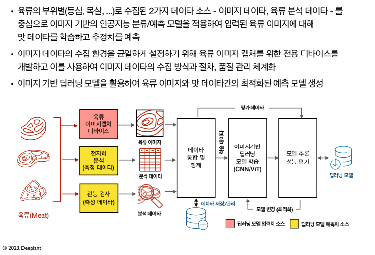
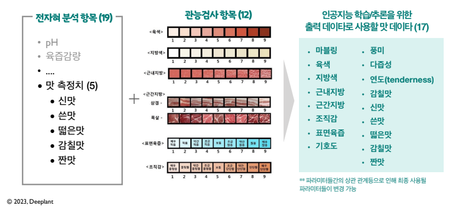

# Deeplant
딥러닝기반 육류 맛 선호 예측 시스템 개발 프로젝트.
### 프로젝트 목표
육류에 대한 고객/구매자의 '맛에 대한 선호도(tasty preference)' 데이타를 육류 이미지와 분석된 미각
데이타로 나누어 체계적으로 수집하고, 이를 기반으로 이미지 기반의 육류에 관한 상세한 맛 데이타를
자동으로 분류하고 예측하는 인공지능 예측 모델을 구축하여 향후 고객/구매자들에게 최적화된 육류
개인화 추천을 위한 시스템 개발을 목표로 합니다.
### 시스템 소개



### 맛 데이터
* 맛 데이터는 전자혀를 통해 얻어진 육류 분석 데이터와 관능검사 데이터 중에서 유효 파라미터들로 구성.
* 총 31개 항목중 "전자혀 분석"의 맛 측정치 항목(5)과 "관능검사" 항목(12)을 합하여 총 17개를 사용




# Installation
Ensure you have a python environment, `python=3.8.10` is recommended.
cuda를 사용가능한 Nvdia GPU 추천. 
```sh
pip install -r requirement.txt
```
(option)
```sh
pip install transformers datsets accelerate nvidia-ml-py3
```

# Quick Start ⚡
1. Clone repository
    ```sh
    git clone https://github.com/Deeplant2/Deeplant.git
    ```
2. Run model
    ```sh
    python manage.py --run 'test' --ex 'test'
    ```

# Additional.
## Create Custom Model
기본적인 pytorch 모델 제작법과 같다. pytorch 모델 제작법은 공식 document 참고.
1. 'ml_training/models' 폴더에 custom model code를 적을 .py 파일 생성.
2. pytorch 기반의 모델 클래스 제작.
3. 모델 클래스의 forward 부분에 들어오는 입력 값이 list이므로 이 부분을 주의해서 코드 작성.
4. 클래스 안에 getAlgorithm 함수 추가. `classification` or `regression` 리턴.
5. 제작한 class를 return 하는 외부에서 접근 가능한 create_model() 함수 추가.

## Configuration file 작성
1. 아무 configuration file 복사.
2. 시스템 설명서의 configuration file 설명을 보면서 상황에 맞게 작성.

## Create Custom Loss
'ml_training/loss/loss.py'에 custom loss 코드 작성 권장. 

## Add Image Transform Variation
'ml_training/loss/transform.py'에 원하는 transform 추가 후 configuration file에서 사용.

# 사용 모델
* ViT
* CNN
* CoAtNet

# 사용 데이터 셋
## 등급 예측
| Name | Data Type | Range |
|---|---|---|
|image src|string|
|grade|string| 1++. 1+, 1, 2, 3|

* 75000개의 AI-hub 육류 이미지 사용.
## 맛 데이터 예측
| Name | Data Type | Range |
|---|---|---|
|image src|string|
|color|float|1 ~ 5|
|marbling|float|1 ~ 5|
|texture|float|1 ~ 5|
|surface moisture|float|1 ~ 5|
|total|float|1 ~ 5|
|grade|string| 1++. 1+, 1, 2, 3|

* 1687개의 육류 이미지 사용.
* 데이터 셋의 범위는 0 ~ 10으로 바뀔 예정이기 때문에 재학습 필수
# 결과 및 성능
## 등급 예측
### CNN
| Model | # Params | Accuracy |
|---|---|---|
|resnetrs152.tf_in1k|86M|0.974|
|tf_efficientnetv2_l.in21k_ft_in1k|118M|0.977|
### ViT
| Model | # Params | Accuracy |
|---|---|---|
vit_base_patch32_clip_448.laion2b_ft_in12k_in1k|88M|0.974|

## 맛 데이터 예측
### CNN
| Model | # Params | R2 score | Average acc. |
|---|---|---|---|
|resnetrs152.tf_in1k|86M|0.1|0.458|
### ViT
| Model | # Params | R2 score | Average acc. |
|---|---|---|---|
|vit_base_patch16_clip_224.laion2b_ft_in12k_in1k|88M|0.457|0.596|
|vit_base_patch32_clip_448.laion2b_ft_in12k_in1k|88M|0.463|0.607|
### CoAtNet
| Model | # Params | R2 score | Average acc. |
|---|---|---|---|
### 통계 자료 활용 (add)
| Model | # Params | R2 score | Average acc. |
|---|---|---|---|

### 통계 자료 활용 (channel extention)
| Model | # Params | R2 score | Average acc. |
|---|---|---|---|

### Feature map ViT
| Model | # Params | R2 score | Average acc. |
|---|---|---|---|

### CNN + SE block
| Model | # Params | R2 score | Average acc. |
|---|---|---|---|

# manage.py Start Argument
|args|용도|
|---|---|
|run|mlflow run 이름 설정|
|ex, experiment|mlflow expriment 이름 설정|
|model_cfgs|모델 configuration file 경로 설정|
|mode|train or test 모드 설정|
|epochs|학습 시 반복 횟수 설정|
|log_epoch|몇번 반복 시 모델을 저장할 것인지 설정|
|lr, learning_rate|학습 결과를 모델에 얼만큼 반영할 것인지 설정|
|data_path|csv가 저장된 폴더의 경로|
|csv_name|csv파일 이름|
|sanity|True/False, True면 코드의 작동만 확인하기 위해 한 배치만 학습하고 나머지는 스킵함|

# Reference

# License
